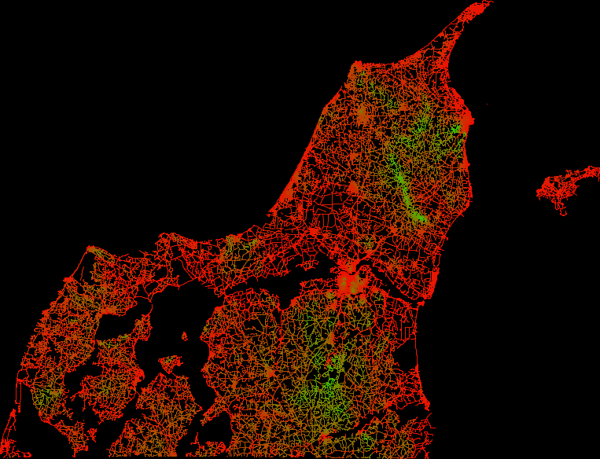

### The dataset
The [3D_spatial_network.csv](https://archive.ics.uci.edu/ml/datasets/3D+Road+Network+%28North+Jutland%2C+Denmark%29) dataset contains all the roads in North Jutland, Denmark. Every row in the dataset is a point on a road. There are four attributes: the OpenStreetMap ID, latitude, longitude, and altitude of the point on the road.
